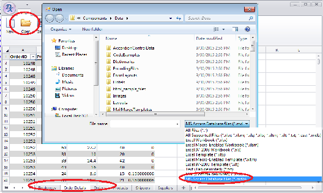

<!-- default badges list -->

[](https://supportcenter.devexpress.com/ticket/details/T304456)
[](https://docs.devexpress.com/GeneralInformation/403183)
[](#does-this-example-address-your-development-requirementsobjectives)
<!-- default badges end -->

# Spreadsheet for WinForms - How to Load an MS Access Database File into the SpreadsheetControl's Document

This example demonstrates how to extend the list of supported files which is displayed in the "Open File" dialog with the "MDB" file format while loading a document into the SpreadsheetControl.



## Implementation Details

To extend this list, implement a custom `AccessDBDocumentImporter` class. To add this functionality to an existing project, execute the `SpreadsheetControl.ExtendOpenFileCommand` method:

```cs
spreadsheetControl1.ExtendOpenFileCommand();
```

Implement a `LoadMSAccessFile` method to load data from an MS Access Database file. This method can be used for the SpreadsheetControl's document and the Workbook instance.

## Files to Review

* [Form1.cs](./CS/WindowsFormsApplication1/Form1.cs) (VB: [Form1.vb](./VB/WindowsFormsApplication1/Form1.vb))
* [MSAccessImportHelper.cs](./CS/WindowsFormsApplication1/MSAccessImportHelper.cs) (VB: [MSAccessImportHelper.vb](./VB/WindowsFormsApplication1/MSAccessImportHelper.vb))
<!-- feedback -->
## Does this example address your development requirements/objectives?

[](https://www.devexpress.com/support/examples/survey.xml?utm_source=github&utm_campaign=winforms-spreadsheet-load-an-ms-access-database-file-into-the-document&~~~was_helpful=yes) [](https://www.devexpress.com/support/examples/survey.xml?utm_source=github&utm_campaign=winforms-spreadsheet-load-an-ms-access-database-file-into-the-document&~~~was_helpful=no)

(you will be redirected to DevExpress.com to submit your response)
<!-- feedback end -->
